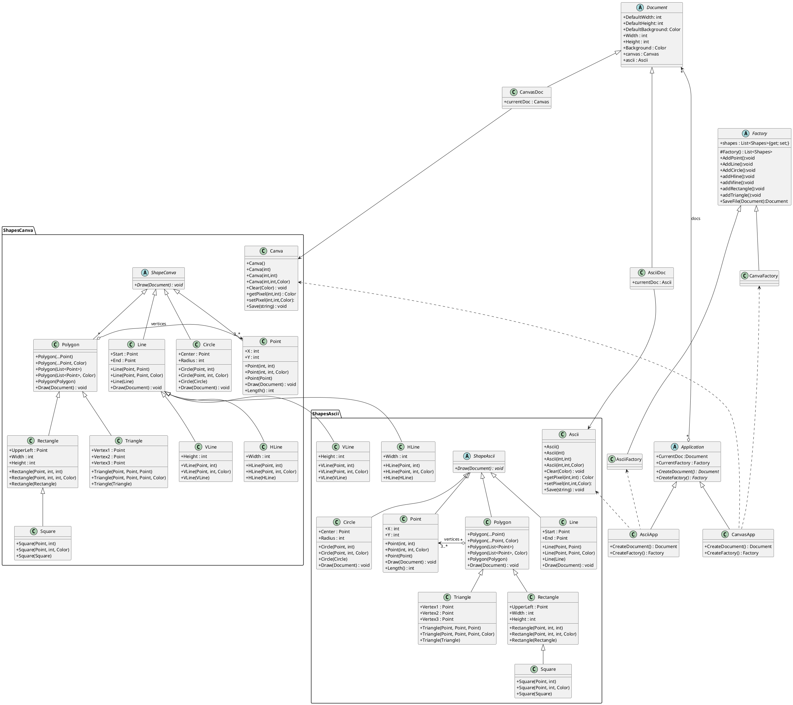

# Lab2 Olivier Lefebvre

```plantuml
@startuml

Abstract class Factory{
  +shapes : List<Shapes>{get; set;}
  #Factory() : List<Shapes>
  +AddPoint():void
  +AddLine():void
  +AddCircle():void
  +addHline():void
  +addVline():void
  +addRectangle():void
  +addTriangle():void
  +SaveFile(Document):Document

}
Factory <|-- CanvaFactory
class CanvaFactory{
}

Factory <|-- AsciiFactory
class AsciiFactory{
}


abstract class Document {
  +DefaultWidth: int
  +DefaultHeight: int 
  +DefaultBackground: Color
  +Width : int
  +Height : int
  +Background : Color
  +canvas : Canvas
  +ascii : Ascii
}
Document <|-- CanvasDoc
Document <|-- AsciiDoc

class CanvasDoc{
+currentDoc : Canvas
}
class AsciiDoc{
+currentDoc : Ascii
}

CanvasDoc ---> ShapesCanva.Canva
AsciiDoc ---> ShapesAscii.Ascii

abstract class Application {
  +CurrentDoc :Document
  +CurrentFactory : Factory
  +{abstract} CreateDocument() : Document
  +{abstract} CreateFactory() : Factory
}
Document "*" <-o "*" Application :docs  

class CanvasApp {
   +CreateDocument() : Document
   +CreateFactory() : Factory
}
Application <|-- CanvasApp
ShapesCanva.Canva <. CanvasApp
CanvaFactory <.... CanvasApp

class AsciiApp {
   +CreateDocument() : Document
   +CreateFactory() : Factory

}
Application <|-- AsciiApp
ShapesAscii.Ascii <.. AsciiApp
AsciiFactory <.. AsciiApp


namespace ShapesCanva{

skinparam classAttributeIconSize 0
 
 class Canva{

  +Canva()
  +Canva(int)
  +Canva(int,int)
  +Canva(int,int,Color)
  
  +Clear(Color) : void
  +getPixel(int,int) : Color
  +setPixel(int,int,Color):
  +Save(string) : void
}

abstract class ShapeCanva {
{abstract} +Draw(Document) : void
}

class Point {
+X : int
+Y : int
+Point(int, int)
+Point(int, int, Color)
+Point(Point)
+Draw(Document) : void
+Length() : int
}
ShapeCanva <|-- Point

class HLine {
+Width : int
+HLine(Point, int)
+HLine(Point, int, Color)
+HLine(HLine)
}
Line <|-- HLine

class VLine {
+Height : int
+VLine(Point, int)
+VLine(Point, int, Color)
+VLine(VLine)
}
Line <|-- VLine

class Line {
+Start : Point
+End : Point
+Line(Point, Point)
+Line(Point, Point, Color)
+Line(Line)
+Draw(Document) : void
}
ShapeCanva <|-- Line

class Polygon {
+Polygon(...Point)
+Polygon(...Point, Color)
+Polygon(List<Point>)
+Polygon(List<Point>, Color)
+Polygon(Polygon)
+Draw(Document) : void
}
ShapeCanva <|-- Polygon
Point "3..*" <-o "*" Polygon : vertices

class Triangle {
+Vertex1 : Point
+Vertex2 : Point
+Vertex3 : Point
+Triangle(Point, Point, Point)
+Triangle(Point, Point, Point, Color)
+Triangle(Triangle)
}
Polygon <|-- Triangle

class Rectangle {
+UpperLeft : Point
+Width : int
+Height : int
+Rectangle(Point, int, int)
+Rectangle(Point, int, int, Color)
+Rectangle(Rectangle)
}
Polygon <|-- Rectangle

class Square {
+Square(Point, int)
+Square(Point, int, Color)
+Square(Square)
}
Rectangle <|-- Square

class Circle {
+Center : Point
+Radius : int
+Circle(Point, int)
+Circle(Point, int, Color)
+Circle(Circle)
+Draw(Document) : void
}
ShapeCanva <|-- Circle


}
namespace ShapesAscii {

class Ascii{

  
  +Ascii()
  +Ascii(int)
  +Ascii(int,int)
  +Ascii(int,int,Color)
  
  +Clear(Color) : void
  +getPixel(int,int) : Color
  +setPixel(int,int,Color):
  +Save(string) : void
}

abstract class ShapeAscii {
{abstract} +Draw(Document) : void
}

class Point {
+X : int
+Y : int
+Point(int, int)
+Point(int, int, Color)
+Point(Point)
+Draw(Document) : void
+Length() : int
}
ShapeAscii <|-- Point

class HLine {
+Width : int
+HLine(Point, int)
+HLine(Point, int, Color)
+HLine(HLine)
}
Line <|-- HLine

class VLine {
+Height : int
+VLine(Point, int)
+VLine(Point, int, Color)
+VLine(VLine)
}
Line <|-- VLine

class Line {
+Start : Point
+End : Point
+Line(Point, Point)
+Line(Point, Point, Color)
+Line(Line)
+Draw(Document) : void
}
ShapeAscii <|-- Line

class Polygon {
+Polygon(...Point)
+Polygon(...Point, Color)
+Polygon(List<Point>)
+Polygon(List<Point>, Color)
+Polygon(Polygon)
+Draw(Document) : void
}
ShapeAscii <|-- Polygon
Point "3..*" <-o "*" Polygon : vertices

class Triangle {
+Vertex1 : Point
+Vertex2 : Point
+Vertex3 : Point
+Triangle(Point, Point, Point)
+Triangle(Point, Point, Point, Color)
+Triangle(Triangle)
}
Polygon <|-- Triangle

class Rectangle {
+UpperLeft : Point
+Width : int
+Height : int
+Rectangle(Point, int, int)
+Rectangle(Point, int, int, Color)
+Rectangle(Rectangle)
}
Polygon <|-- Rectangle

class Square {
+Square(Point, int)
+Square(Point, int, Color)
+Square(Square)
}
Rectangle <|-- Square

class Circle {
+Center : Point
+Radius : int
+Circle(Point, int)
+Circle(Point, int, Color)
+Circle(Circle)
+Draw(Document) : void
}
ShapeAscii <|-- Circle

}
@enduml
```
